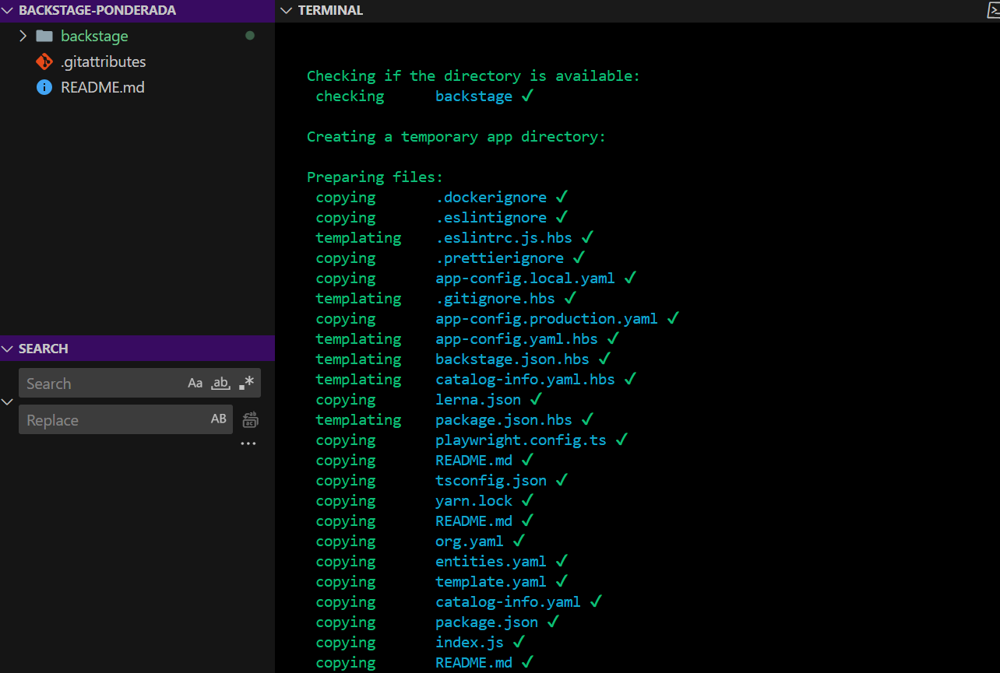
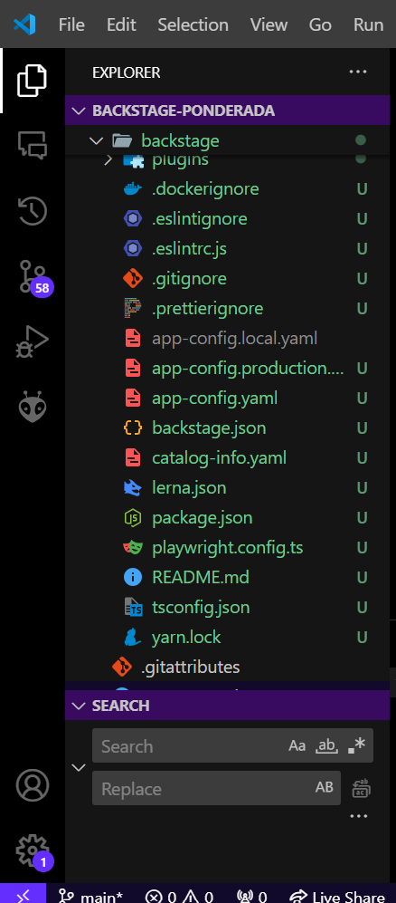
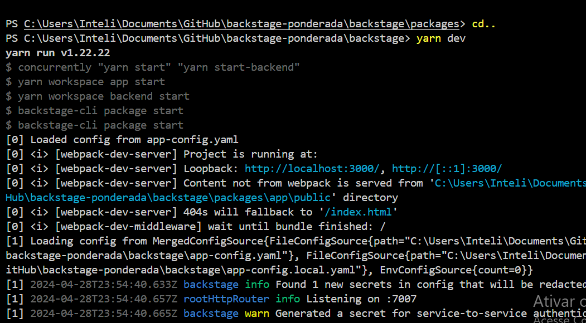
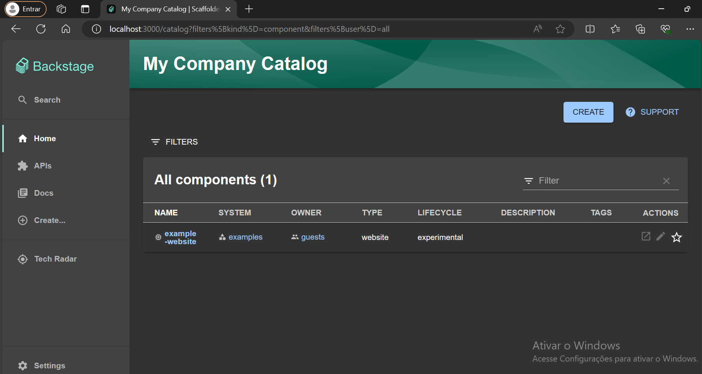

# Documentação do processo de compilação e execução do Backstage

O processo de compilação e execução do Backstage é fundamental para configurar um ambiente de desenvolvimento adequado. O processo é simples e pode ser feito seguindo os links abaixo:

https://backstage.io/docs/getting-started/

https://backstage.io/docs/deployment/docker/

Abaixo estão os passos detalhados para realizar esse processo.

## Passo 1: Criação do Projeto Backstage

Para começar, execute o seguinte comando para criar um novo projeto Backstage:

```bash
npx create-backstage-app@latest
```

Este comando criará uma estrutura de projeto inicial para você começar a trabalhar.




## Registro da arquitetura criada




A imagem acima mostra a estrutura de arquivos e pastas do projeto Backstage, incluindo o arquivo `package.json`, que contém as configurações e dependências do projeto.


## Passo 2: Instalação de Dependências

Após criar o projeto, navegue até o diretório do projeto recém-criado e instale as dependências usando o yarn:

```bash
cd backstage-ponderada\backstage> 
yarn install
```

Este comando instalará todas as dependências necessárias para o projeto.


## Passo 3: Iniciar o Servidor de Desenvolvimento

Agora, inicie o servidor de desenvolvimento executando o seguinte comando:

```bash
yarn dev
```

Este comando iniciará o servidor de desenvolvimento do Backstage, permitindo que você visualize e interaja com sua aplicação.

## Execução do Servidor de Desenvolvimento

Este print mostra a saída do terminal após iniciar o servidor de desenvolvimento do Backstage com sucesso.


##  Aplicação  Executada e Imagem do Catálogo de Serviço

A imagem abaixo ilustra o Backstage em execução. O servidor de desenvolvimento foi iniciado com êxito, e a ferramenta está sendo executada na porta 3000 e a imagem segue abaixo.


